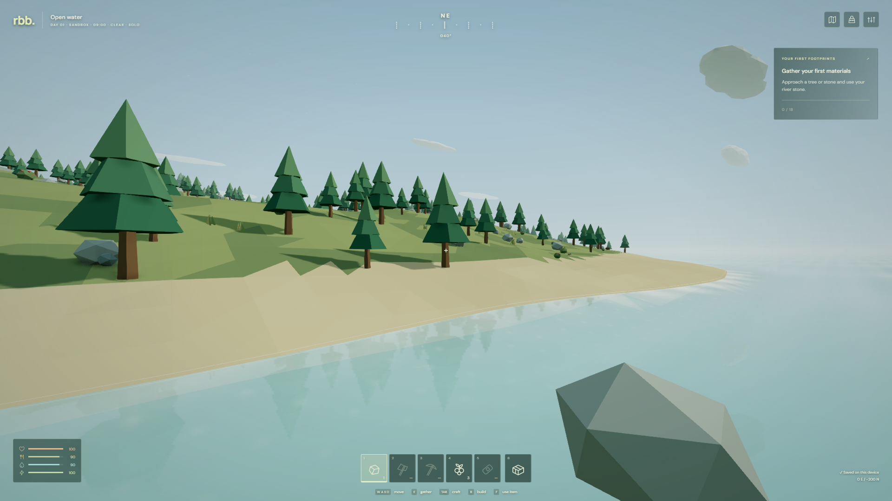

# RBB · The quiet frontier

[](https://github.com/michaelcrosato/rbb/actions/workflows/ci.yml)

A low-poly survival sandbox built on **Three.js r186**, TypeScript, and a deterministic simulation shared by browser and server. AI authors the implementation; humans direct features, playtest, and tune the balance.

Explore a seeded island, salvage abandoned landmarks, mine rich quarries, craft equipment, and reinforce a shared base. Start a solo expedition immediately or connect to a persistent cooperative world. This is an expandable foundation alpha, not a complete Rust clone.



## Run locally

Install **Node 24** (see `.nvmrc`), then:

```sh
npm ci
npm run dev
```

Open **http://localhost:5173**. No account, assets service, database, or environment variables are needed for solo play. The game saves on the current browser origin; use **Pause → Export save** to keep a portable backup or move between localhost and a hosted deployment.

Solo expeditions open in one tab at a time on HTTPS and localhost. Return the active tab to the main menu or close it before continuing in another tab. The next tab reads the latest saved progress. See [save protection and limits](docs/qa.md#current-limits) for non-secure LAN origins.

For a shared world, run this in another terminal:

```sh
npm run dev:server
```

Choose **Join a world**, enter `ws://localhost:8787`, and join. Up to **4 players** can explore, gather, craft and build in the same world simultaneously. Open **Crew & invite** from Pause (or the `1/4` HUD button) to see your crew and copy an invite link. The map shows your teammates. A fifth player receives a world-full message and can join when someone leaves.

The server creates `data/world.db`. Other clients on your LAN need the host's address and their exact browser origin listed in `ALLOWED_ORIGINS`; localhost links only work on the host computer. Production clients use HTTPS and `wss://`. See the [four-player hosting walkthrough](docs/deployment.md#play-together-locally-or-on-a-lan).

## Play

| Control        | Action                                            |
| -------------- | ------------------------------------------------- |
| WASD / arrows  | Move                                              |
| Mouse          | Look; drag if uncaptured; double-click to capture |
| Shift / Space  | Sprint / jump                                     |
| C              | Hold to dive; release to surface                  |
| E / left mouse | Gather, attack, collect, or place a building      |
| Tab / I        | Pack and crafting                                 |
| 1–5            | Equip your five customizable quick slots          |
| B / 6          | Building menu; B cancels placement                |
| T              | Terrain tools: dig, deposit dirt, flatten         |
| R              | Sample terrain level, or rotate building          |
| F              | Use equipped consumable, or eat a berry           |
| M / Esc        | Map / pause                                       |
| F2             | Developer tools                                   |

Touch has a movement stick, drag-to-look, sprint, jump, dive, use, eat, rotate, pack, and map controls. Landscape offers more room. Solo pauses in menus; developer tools can run or pause the simulation independently. Shared worlds continue running. Disconnected survivors stop simulating. Empty servers pause world time.

Haven meadow has guaranteed wood, stone, flax, berries, and a freshwater spring on every seed. A hatchet costs 12 wood, 8 stone, 3 fiber. A foundation costs 24 wood and 12 stone. Campfires unlock nearby cooking and healing; bedrolls set respawn. Boars defend territory and wolves hunt beyond the starter refuge. Death leaves a supply pack for 30 world minutes. Watch your air when diving.

Use **Pack → Details / drop** to split a stack or assign a quick slot. Aim at ground supplies and use **E / Use** to collect a quantity; teammates can collect your drops. Open **Map**, select a landmark or quarry to track, and explore for scrap, machine parts, ore and provisions. Build a furnace to smelt ore and a workbench for advanced recipes. Wear a trail pack for 90 kg capacity or a hide vest for protection against wildlife.

Build doorways, working doors, windows, upper floors, stairwells, roofs, stairs, fences and shared storage. Aim at an existing piece and use **E / Use** to inspect, repair or upgrade timber → stone → metal. Nearby players can use shared chests and doors. [Progression controls, crafting loop and limits](docs/progression-expansion.md).

## What is implemented

- 640 × 640 m seeded island with sparse volumetric terrain edits, matching cave-floor/ceiling collision, chunk remeshing, spatial resource queries, instanced foliage/buildings, and adaptive resolution with recovery. Players can excavate, deposit dirt, flatten ground and build cave bases; developer tools add larger sphere/box, smooth and restore brushes. [Terrain controls and architecture](docs/terrain.md).
- Moving sun and moon lighting/shadows, dawn/dusk, phased moon, stars, six weather conditions, foliage wind, wetness/snow, ocean waves/reflections/foam, underwater atmosphere, campfire lights and ambient particles. Optional AO, bloom, sun shafts, lens flare, planar coastal reflections and color controls. [Feature matrix and limits](docs/rendering-and-world.md).
- Advanced opt-in rendering: cascaded shadows, volumetric clouds/fog, rasterized indirect-light probes, screen reflections, temporal upscaling, motion blur, depth of field, GPU occlusion queries and distant GPU-buffer residency. All default off, including on High. [Pipeline, comparisons, costs and next steps](docs/rendering-pipeline.md).
- Fixed 30 Hz simulation, movement/jump/swim/dive, oxygen, stamina, hunger/thirst, resource depletion/regrowth, bounded inventories, atomic recipes, building validation, wildlife combat, cooking, healing, death/respawn, and persisted milestones.
- 33 items, 23 recipes and 15 building pieces; batch crafting, furnace/workbench requirements, improved tools, spears/bows/firearms and ammunition, worn equipment, configurable quick slots, partial item transfers and shared storage.
- Three persistent loot landmarks and three rich material quarries per seed, map tracking, finite shared loot and world-time restocking. Four-storey bases use shared collision/support geometry, working doors, graded durability, repair, wildlife damage and dependent-piece collapse.
- Five land species (boar, deer, wolf, fox, rabbit) and three marine species (fish, turtle, dolphin), habitat-aware movement, threat responses, animation, loot and respawn.
- Quick developer tools, 27 editable world variables, named/importable variations, entity inspection and recoverable solo checkpoints. Online mutations require an explicitly enabled test server.
- Version 4 solo saves with explicit v1/v2/v3 migration, schema validation, previous-save recovery, export/import, and storage failure messages. Network protocol 4 requires matching client/server upgrades. Existing terrain and resource locations remain stable; new sites conflicting with an old camp or terrain edit are suppressed on migration.
- Four-player cooperative worlds with invites, live crew roster, teammate map markers and smoothed remote survivors. Optional authoritative Node/WebSocket server: command validation, replay protection, speed and reach authority, action/payload/connection limits, origin checks, private inventories, guest resume sessions, reconnect backoff, stale-input clearing, slow-client rejection, SQLite WAL snapshots, recovery and health endpoint.
- Reproducible npm toolchain; lint, typecheck, build, simulation/abuse/persistence tests, desktop and touch browser tests, CI artifacts, container setup, and Vercel configuration.

## Develop and verify

```sh
npm run check          # types, lint, unit/integration tests, client + server build
npm run test:install   # matching Chromium + Linux system dependencies
npm run test:e2e       # real browser controls, WebGL, saves, multiplayer and touch
npm run test:coverage  # unit/integration V8 report in coverage/
npm run format:check
npm run benchmark      # 100-piece camp workload; dev server + installed Chrome required
npm run benchmark:rendering # per-effect GPU timing and comparison screenshots
npm run preview       # serve the production client on :4175
npm run start:server   # run the built world server
```

Tests use temporary databases. Browser test artifacts are in `test-results/` and `playwright-report/`; neither is committed. Development builds expose `window.rbbDiagnostics()`, which returns **read-only copies** for AI navigation and bug reports. Browser tests use real controls, including the visible developer tools when testing sandbox workflows; they do not call hidden gameplay mutators.

See [testing setup and failure diagnosis](docs/testing.md) for port overrides, coverage scope, shared browser error capture and CI artifacts.

Open **F2** or **Pause → Developer tools** to preview time/weather, spawn wildlife, fly, build freely, sculpt terrain, inspect entities and tune a variation without editing code. A world mutation marks the expedition as a sandbox and captures a solo recovery checkpoint. Normal **Settings → Rendering effects** changes only your device, including on ordinary multiplayer servers.

Start with [architecture](docs/architecture.md), [rendering and developer tools](docs/rendering-and-world.md), [adding content](docs/adding-content.md), [QA and limits](docs/qa.md), and the [roadmap](docs/roadmap.md). Read [AGENTS.md](AGENTS.md) before editing.

## Hosting and hardware

Import this repository into Vercel; the checked-in configuration builds the static Vite client. Solo works without a backend. The persistent world server has a Dockerfile and Compose configuration and needs one process plus persistent storage per world. Do not run multiple replicas against one world database.

The design targets **RTX 3070 Ti** desktops and **Galaxy S25** phones. Auto, Low, Mobile, Balanced and High presets provide adjustable rendering cost; optional effects can be enabled independently. **Low preserves survival rules, wildlife, inventory and progression.** Emulated mobile tests verify controls and layout; they do not prove physical S25 frame rate, battery use, or thermal performance. Recorded evidence and remaining hardware QA live in [docs/qa.md](docs/qa.md).

Current scope is a small cooperative alpha. PvP, accounts, storage locks/permissions, tool durability, research trees, queued production, production moderation, distributed world ownership, and client prediction are future work. Crafting is immediate near the required station; ranged hunting uses authoritative hit checks with inventory ammunition. All geometry and sounds are procedural; fonts are bundled locally. Dependencies retain their own licenses. RBB code is MIT licensed.
