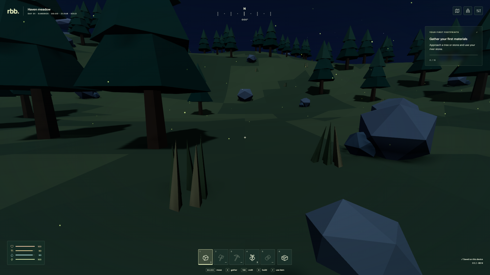
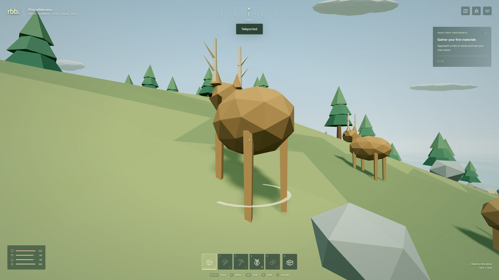
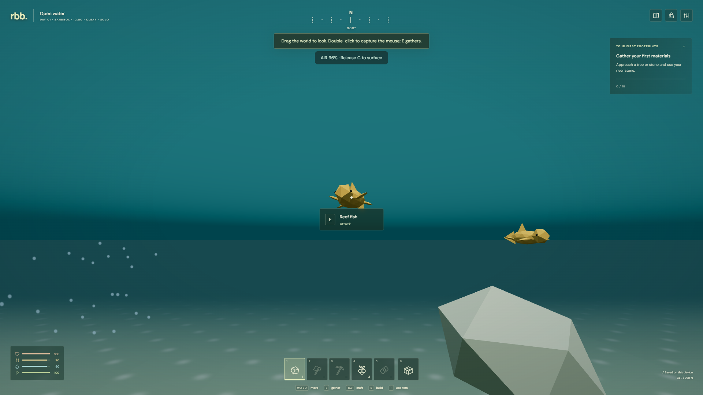

# Rendering and living world

RBB 0.3 keeps the faceted island style and adds independent outdoor rendering systems. The targets are **RTX 3070 Ti at 1080p** and **Galaxy S25**, with a separate Low preset for older hardware. Those targets still require physical-device measurements; see [QA](qa.md).

The new [advanced rendering guide](rendering-pipeline.md) explains cascaded shadows, volumetric clouds/fog, indirect-light probes, screen-space reflections, temporal upscaling, motion blur, depth of field and GPU visibility/residency. Every new switch is **off by default**, including on High. It includes the shared pipeline, comparisons, measurements, implementation decisions and remaining limits.

## Effects available now

| System                | Implementation                                                                                                                            | Cost / limits                                                                                                               |
| --------------------- | ----------------------------------------------------------------------------------------------------------------------------------------- | --------------------------------------------------------------------------------------------------------------------------- |
| Sun and moon          | Continuous celestial directions, latitude and season, visible discs, phased/cratered moon, matching directional lights and moving shadows | One active directional shadow caster; a 120 m square shadow region follows the camera                                       |
| Night and atmosphere  | Gradient sky, dawn/dusk glow, 1,500 rotating/twinkling stars, blue night fill, optional gradual eye adaptation                            | Analytic atmosphere; exposure adaptation follows daylight rather than reading back screen luminance                         |
| Weather               | Clear, cloudy, fog, rain, storm and snow; smooth transitions; deterministic automatic choices                                             | Shared state and visibility cues remain on every quality tier                                                               |
| Clouds and wind       | Instanced faceted cloud banks, continuous overcast layer, foliage bending with matching shadow deformation                                | This is the default cloud model; optional volumetric clouds replace it                                                      |
| Precipitation         | Wind-driven rain streaks, snowflakes, underwater bubbles, storm flashes and procedural thunder                                            | Bounded particle batch: 180 Low / 500 Mobile / 1,800 desktop                                                                |
| Ground and foliage    | Accumulating wetness, lower wet roughness, snow on upward faces, animated underwater caustics                                             | Shader effects on terrain and resource materials; no deformable snow or puddle geometry                                     |
| Ocean                 | Depth-colored water, wave displacement, normal ripples, Fresnel sky/sun/moon reflections and shoreline foam                               | Cheap analytic reflection is the baseline; water physics uses a flat sea level                                              |
| Coastal reflection    | Optional planar reflection of actual terrain, props and actors with wave distortion                                                       | Extra scene render near the coast, above water and below 70 m altitude; 256–1,024 px target; disabled inland and underwater |
| Underwater            | Teal depth fog, caustics and drifting bubbles; diving, oxygen and surfacing                                                               | No screen refraction or underwater post pass required                                                                       |
| Camp lighting         | Four pooled flickering point lights, one on Mobile                                                                                        | No point-light shadow maps; cooking and healing work identically when lights are off                                        |
| Ambient life          | Dust by day, fireflies at night, rising campfire embers                                                                                   | One 512-point batch; omitted on Low                                                                                         |
| Optional post effects | GTAO ambient occlusion, bloom, occluded sun shafts, subtle lens flare, saturation/contrast and FXAA                                       | Targets allocated only while needed; AO uses half resolution, sun mask quarter resolution                                   |
| Debug rendering       | Wireframe, nearby collision bounds, FPS/frame time, total draw calls, triangles and GPU resource counts                                   | Developer tools; diagnostics return copies and cannot change state                                                          |

## Quality and progression

**Settings → Rendering effects** exposes the independent switches. “Enable enhanced effects” selects AO, bloom, sun shafts, lens flare and coastal reflections; Apply settings commits the choice. They remain opt-in, including on High, so choosing a longer view distance does not unexpectedly enable extra scene renders.

| Preset   | Maximum pixel ratio before scale | Shadow maps                 | Ocean grid segments | Distant trees / terrain |
| -------- | -------------------------------- | --------------------------- | ------------------- | ----------------------- |
| Low      | 0.8                              | Off                         | 24                  | 240 m                   |
| Mobile   | 1.15                             | Off                         | 64                  | 240 m                   |
| Balanced | 1.4                              | 1,024 px                    | 128                 | 380 m                   |
| High     | 1.75                             | Sun 2,048 px; moon 1,024 px | 192                 | 560 m                   |

Ratios are capped by device pixel ratio and render-target size; view-distance and resolution multipliers are adjustable. Auto chooses Mobile for coarse-pointer devices and Balanced otherwise, reduces resolution below 42 FPS, and recovers gradually after sustained 58+ FPS. Low suppresses post effects, planar reflections, decorative particles, local lights, water detail and every advanced switch while retaining saved preferences. Explicit cascaded shadows can enable directional shadows on Mobile. The enhanced-effects button does not select the advanced switches.

Quality settings never enter shared state. Low retains the same resources, collision, animal population, AI, damage, needs, recipes, inventory, milestones and progression. RBB currently has milestones rather than a ranked score. Shorter draw distances affect distant presentation; they do not despawn simulation entities. Only explicit developer mutations mark an expedition as a sandbox.

## Time and weather

The default full day takes 1,200 real seconds. The sky has its own deterministic clock: seeking dawn or freezing the sun does not rewind resource, loot or wildlife timers. Latitude defaults to 35° north and season to spring. Season is a tunable value, not an automatically advancing calendar.

Moon phase advances over a 28-day lunar cycle. Its contribution depends on elevation, illuminated fraction, cloud attenuation and **moon size squared × moon brightness**. A 2× moon has 4× the light contribution at the same phase and elevation; a new moon contributes no direct light. The visible disc scales with size. A low ambient floor and optional eye adaptation keep the scene readable while preserving the lighting difference.

Automatic weather chooses a new target every 240 real seconds, blending over 20 seconds by default. Winter allows automatic snow; any condition is selectable manually. Wetness and snow cover accumulate and decay gradually. Ground-state controls allow immediate material previews. Storm flashes share weather time across clients; the flash/thunder effect does not damage players. Weather does not yet change temperature, traction or survival balance.

## Developer workflow

Open **F2**, or **Pause → Developer tools** on keyboard and touch. The world keeps rendering and, by default, simulating while this panel is open. Solo simulation can be paused separately; other solo menus pause normally. Closing the panel remains accessible while scrolling long forms.

- **Quick tools:** seek time, freeze/accelerate sky, choose weather and moon phase, face sun/moon, heal, replace pack with a bounded test kit, return to Haven/coast, toggle invincibility/flight/free building, spawn wildlife, regrow resources, step one or ten seconds, capture/restore checkpoints. Flight follows look direction with W; hold Space/Jump to rise and C/Dive to descend.
- **World variables:** 27 validated controls for celestial motion, weather, wind, water, movement, needs, damage, gathering and wildlife. Apply several values together, restore defaults, undo the last tuning change, preview wet/snowy surfaces, and save/load up to ten named variations. Variation JSON includes world tuning and graphics preferences and can be exported/imported.
- **Rendering:** normal effects, the advanced opt-in group, GPU timing, active passes/fallbacks, probe and residency counters, shared depth/normal/velocity views, wireframe and collision bounds. Bounds are conservative visualization boxes, not an exact rendering of every collision shape.
- **Inspector:** select nearby animals/buildings/bags, inspect state, travel to or remove an entity, use precise X/Z travel and grant bounded inventory items.

Solo captures a full recovery checkpoint before the first world mutation. Checkpoints and variations persist in browser storage when available; failures are reported. Restoring the checkpoint restores the expedition and its sandbox status. Exports remain the portable backup. Free building skips material cost but preserves placement validation and world limits; inventory grants preserve the normal carry limit.

Dedicated servers deny all developer mutations by default. `ALLOW_DEV_TOOLS=true` explicitly makes a **trusted test world** where every joined client can mutate shared tuning and entities; it is not a per-user admin role. Use a separate `DATA_DIR`. A normal server refuses a saved sandbox world. See [deployment](deployment.md). Normal rendering settings remain available on every server.

## Wildlife and saves

The default quiet-frontier population is **56 animals: 42 land and 14 marine**. Boars defend territory; wolves pursue within a home leash; deer, foxes and rabbits flee threats; fish, turtles and dolphins stay in suitable water. Deer and fish can form small groups. Navigation checks terrain, obstacles and habitat; respawn avoids nearby survivors and construction. Models have species-specific silhouettes and animated limbs/fins. Wildlife motion interpolates between snapshots. This is lightweight habitat-aware AI, not a navmesh ecosystem or flocking simulation.

Save version 3 persists environment, tuning, oxygen, species, developer flags and sparse terrain edits. Explicit v1/v2 migrations retain the existing island and progress; v1 migration also seeds the added species. World-generation version remains 1. Network protocol is now 3: update clients and dedicated servers together. Old clients are rejected cleanly rather than interpreting the new state incorrectly. The [terrain guide](terrain.md) describes volumetric caves, sculpting, dirty mesh updates and terrain replication.

## Further rendering work

The non-ray-traced techniques from the 0.2 deferred list now have implementations documented in the [advanced guide](rendering-pipeline.md). Their present limits matter: probes are approximate diffuse lighting; screen reflections cannot see off-screen objects; temporal reconstruction is a custom implementation; visibility/residency retains the finite CPU world. Hardware ray tracing, multi-layer/visibility-aware probes, cloud shadows on terrain, a larger-world generation/network streaming system and GPU indirect submission remain future work. Physical-device profiling should guide the next investment.
