# Advanced rendering foundation · 0.3

The island keeps its low-poly models and existing default appearance. **Every advanced switch starts off, including on High.** Open **Settings → Rendering effects → Advanced rendering**, or **F2 → Rendering**, to try a technique. Low suppresses these switches while keeping saved preferences. No rendering option changes inventory, milestones, wildlife, collision, survival rules, saves or network commands.

These are working WebGL2 implementations with explicit limits. They provide extension points without requiring a new rendering backend. Hardware ray tracing is outside this update. The [main feature guide](rendering-and-world.md) covers the baseline world and developer tools; this page records the advanced choices, evidence and next steps.

## What each switch does

| Switch                     | Implemented behavior                                                                                                                                                                                                          | Main cost / present limit                                                                                                                                                                                                                                      |
| -------------------------- | ----------------------------------------------------------------------------------------------------------------------------------------------------------------------------------------------------------------------------- | -------------------------------------------------------------------------------------------------------------------------------------------------------------------------------------------------------------------------------------------------------------- |
| Cascaded shadows           | Two to four camera-fitted, texel-stabilized directional maps; practical splits and fade; the active sun or moon supplies color and intensity. Reach: 80–500 m. Foliage retains animated shadow geometry.                      | More draws and map memory. Default: three 1,024² maps on Balanced/Mobile, 2,048² on High. Explicitly enabling cascades permits shadows on Mobile. Only directional lights have shadows.                                                                        |
| Volumetric clouds          | 3D density in a cloud slab, weather coverage, wind advection, light absorption and three light-direction density samples. Editable base/thickness; the camera can fly below, inside and above.                                | 8–64 samples at 25–100% internal resolution; default 24 at 50%. Replaces the faceted banks/flat overcast while enabled. One stylized layer; no cloud shadows on terrain or multiple scattering.                                                                |
| Volumetric fog             | Terrain-relative height falloff, spatial density variation, scene-depth termination, sun/moon scattering against actual shadow maps, and nearby camp-light scattering.                                                        | A second bounded integration through at most 300 m. Four-tap depth-aware upsampling preserves silhouettes. Replaces near-ground linear fog above water; underwater retains teal fog. Camp lights are unshadowed.                                               |
| Probe indirect lighting    | Terrain-following 3×3 grid, 40 m spacing. Rasterized reflected surface radiance in 32² cubemap faces; asynchronous readback produces nine spherical-harmonic coefficients per probe, spatially blended in standard materials. | At most one face/frame and 12 faces/second; about 4.5 seconds plus readback to initialize. Adds diffuse bounce to hemisphere/direct light. One height layer can leak through walls; no specular GI, relocation, visibility weighting or multi-storey solution. |
| Screen-space reflections   | Depth/normal-guided, 40-step reflection march on water and wet surfaces. Roughness, normal direction, edges, thickness and distance limit contribution. Misses retain existing material/sky reflection.                       | Shared geometry pass plus a full internal-resolution gather. Only on-screen geometry is available; thin objects and grazing angles can miss. If coastal planar reflection is active, water uses it while SSR remains available on wet ground.                  |
| Temporal upscaling         | 16-sample Halton jitter, lower-resolution scene passes, native-output ping-pong history, motion reprojection, depth rejection, neighborhood clamping and reactive masks. Input: 50–100%, default 67%.                         | Fewer scene/post pixels, but an extra geometry pass and two native history targets. Fine detail can soften; fast/reactive objects favor the current frame. Custom foundation, not FSR, DLSS or an equivalent-quality claim.                                    |
| Motion blur                | Ten bounded samples along camera/object velocity, depth rejection and maximum screen displacement. Temporal jitter is removed from shutter motion.                                                                            | Gather bandwidth. Moving instanced limbs/flames use conservative reactivity rather than exact per-vertex motion. Held tool and DOM interface remain unblurred.                                                                                                 |
| Depth of field             | Sixteen depth-aware disk samples, manual focus distance/aperture, bounded radius, foreground rejection and held-tool protection.                                                                                              | Gather bandwidth. No aperture blades, autofocus, separate foreground dilation or layered transparency. Aperture zero disables blur.                                                                                                                            |
| GPU occlusion culling      | Conservative bounding-box queries against shared depth: 12/frame, at most 48 pending, poll only available results. Two misses hide a distant chunk; movement/turning reveals it immediately.                                  | GPU-assisted visibility with CPU draw submission. Chunks within 24 m and wildlife are never hidden by these queries. Most useful at stable viewpoints; query/depth overhead can exceed savings on this small island.                                           |
| Stream distant GPU buffers | After ten unused seconds beyond the radius, release up to four chunk buffers/frame. Track color, depth, reflection, probe and shadow use. Buffers upload again on return.                                                     | Frees eligible GPU buffers, not CPU geometry or world data. Shared geometry is released only when all users qualify. Finite-island residency, not infinite terrain, network streaming or indirect GPU submission.                                              |

## Shared pipeline and ownership

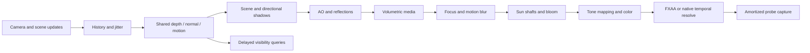

Optional nodes are omitted unless selected. With all optional post/advanced features off, the scene renders directly; no G-buffer, composer, history, volume target or probe grid is allocated. The older GTAO still owns half-resolution normal/depth buffers. Migrating it to shared buffers requires validating its normal conventions/filtering and remains a useful optimization.

The geometry pass writes **view normal + roughness**, **UV velocity + previous depth + reactive mask**, and hardware depth. It follows current/previous transforms, instancing, foliage wind and ocean displacement. Water, new visibility, changed instance matrices and flames reduce history reuse. The held tool has a separate mask; particles, sky, debug bounds and placement overlays are excluded. Sky history uses camera reprojection. Particles and changing cloud radiance do not yet have dedicated reactive buffers, so fast transitions can leave slight trails.

One `FrameState` owns jitter/history. It restores the projection after rendering and rejects history after resize/FOV/settings changes, replacement worlds, camera cuts, water crossings, construction/resource changes and abrupt environment changes. Context loss suspends rendering; restoration rebuilds optional resources and leaves the pause menu open. Solo simulation pauses there; connected shared worlds continue running. Material adapters attach/detach by name, preserving wind/fire when cascades or probes change. Adapter changes retire Three.js's material GPU cache so re-enabling an effect binds its new uniforms/textures; CPU materials stay registered.

Float-target/MRT capability checks suppress unsupported advanced screen effects and probes. Preferences remain saved, and the panel explains suppressed options. The optional GPU timer polls `EXT_disjoint_timer_query_webgl2`, drops disjoint samples and never calls `finish()` or synchronous pixel readback. Probes use Three.js's asynchronous readback API. Generation tags prevent old-grid/world results from updating a replacement grid.

Context loss retires target, geometry and instance disposal listeners while their old GL handles are invalid, retaining CPU geometry for re-upload. Restoration refreshes capability/extension access before rebuilding the graph. The recovery check then leaves and reopens the world, which also catches stale cleanup that would only happen on a later disposal.

Occlusion suppresses a hidden chunk's draw range only for the main camera's color/depth passes. Shadow, reflection and probe cameras retain it. This preserves off-screen contributors, but Three.js still traverses and submits objects; it is not GPU-driven indirect rendering. Residency tracks those other passes too, so a distant shadow caster stays allocated while it is used.

F2's **Shared buffer view** makes the inputs inspectable. These diagnostic captures use the low-resolution browser-test preset. Normals preserve faceted surfaces; the static velocity view shows neutral XY motion on land, a separate blue held-tool mask, and excluded sky. The views are tools for adding and debugging passes, not visual presets.

| Shared view normals                                                                      | Velocity / reactive mask                                                                |
| ---------------------------------------------------------------------------------------- | --------------------------------------------------------------------------------------- |
| 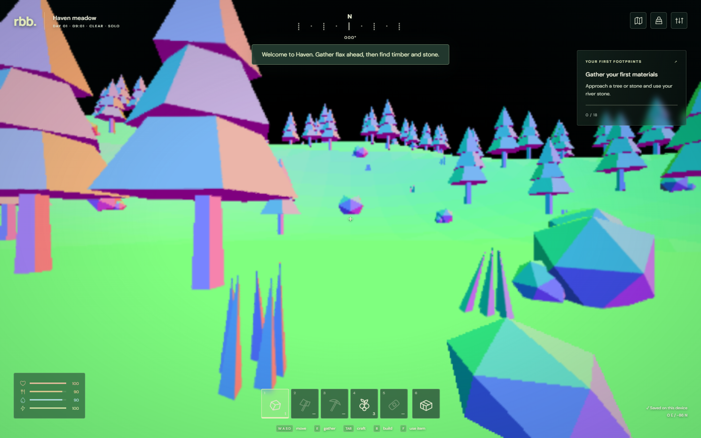 | 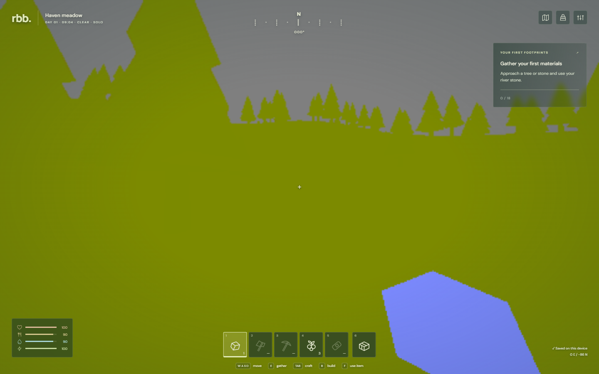 |

The panel reports active passes, fallbacks, probe readiness, visibility/reload counters and target estimates. **Estimated target MiB is not total VRAM**: it covers shared buffers, scene targets, volume target/noise and temporal history. Shadows, old AO/bloom/reflection targets, geometry and driver allocations are additional. Overlay GPU ms measures rendering work; FPS also reflects CPU scheduling and display limits.

## Why these foundations

Depth, normals, motion, camera history and material ownership are reusable building blocks. Future effects can share data, recover after discontinuities and release resources. Spatial probes add diffuse color without coupling lighting to saves. Conservative visibility/residency is a first step toward larger scenes while keeping authoritative world state intact.

All samples, radii and refresh budgets are bounded. A stronger desktop can increase them; a phone can try lower volume or temporal input resolution; Low keeps the original gameplay. Enabling every switch is a stress case, not a recommended artistic preset. Blur, extra fog and multiple reflection methods do not automatically improve every view.

## Visual comparisons and measurements

Run `npm run benchmark:rendering` with the dev server running. It imports a validated 100-piece camp, fixes camera/sky/weather, disables wind and wildlife movement for comparable frames, warms each option and records twelve half-second samples. Separate coast and elevated-cloud views expose reflections and volume shape. `-- --case=cloud` limits matching cases; `-- --software` uses SwiftShader. Output and direct screenshots go to `.artifacts/rendering-benchmark/`.

GPU timing is the median of rolling 30-frame medians; reported p95 is the largest sampled rolling 30-frame p95. This shows probe-refresh variability better than display-limited FPS alone, but is not a laboratory latency trace. Exact GPU, parameters, exceptions and warnings accompany results. Water, fire and ambient particles keep animating, and wetness dries gradually; the fixtures fix initial conditions rather than identical pixels. Mobile viewport results on a desktop GPU do not measure an S25.

### Direct browser captures

All pairs use the same imported scene and camera. Click an image to inspect full resolution. These deliberately modest defaults retain the faceted models; the cloud option replaces the polygon banks with softer density. The camp is a performance fixture with 100 building pieces, including 15 campfires.

| Comparison / what to inspect                                  | Advanced off                                                         | One option enabled                                                                                |
| ------------------------------------------------------------- | -------------------------------------------------------------------- | ------------------------------------------------------------------------------------------------- |
| Fog: separation of near trees and distant hillside            |                        | 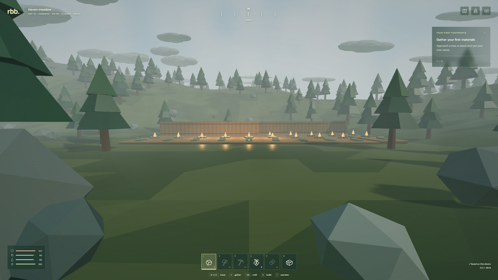                             |
| Cascades: nearby shadow detail and terrain self-shadowing     |                |                         |
| Probes: subtle diffuse color around lit wood and ground       |            | 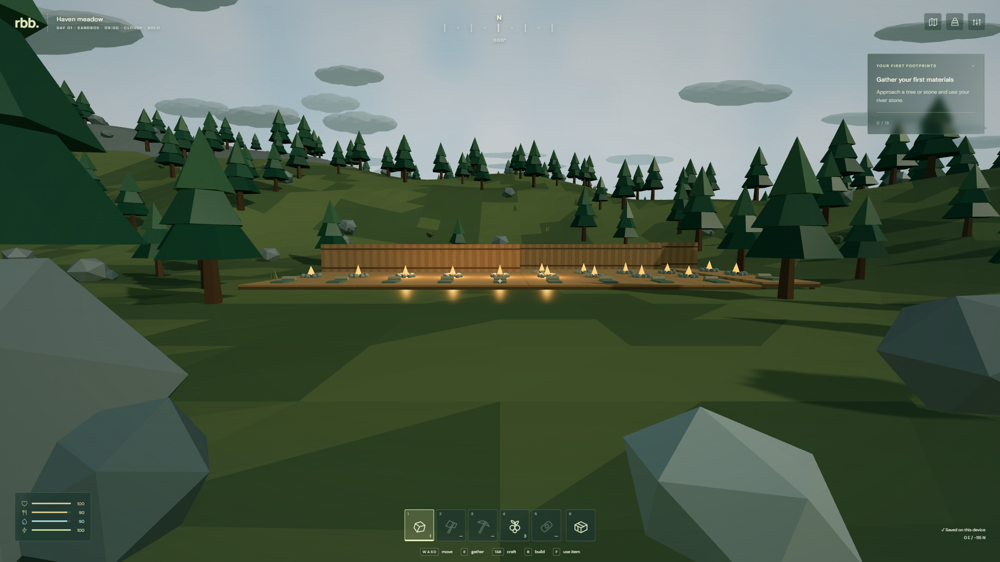               |
| Focus: manual 12 m focus; held stone and interface stay sharp |        | 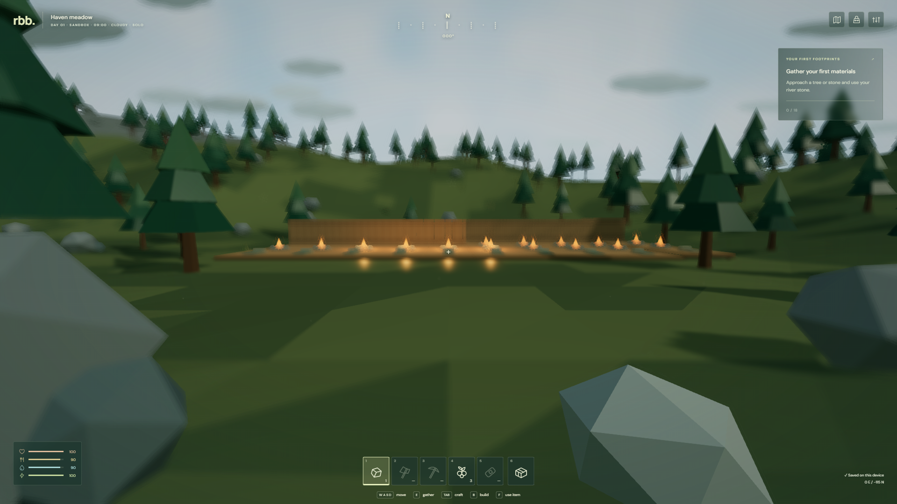                                      |
| Temporal: 67% scene input reconstructed to native output      |                          |  |
| Shore: partial tree reflections on nearby water               | 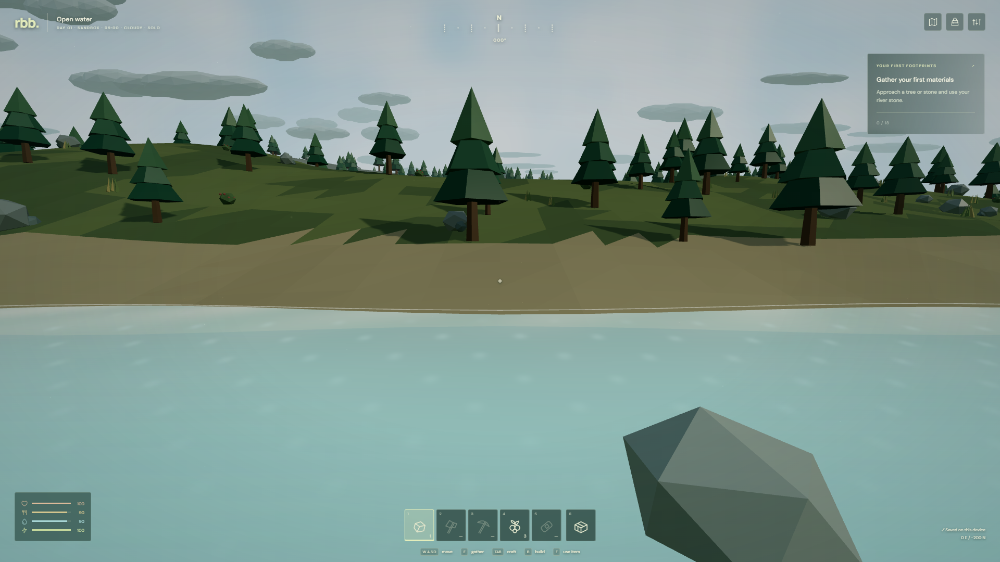  | 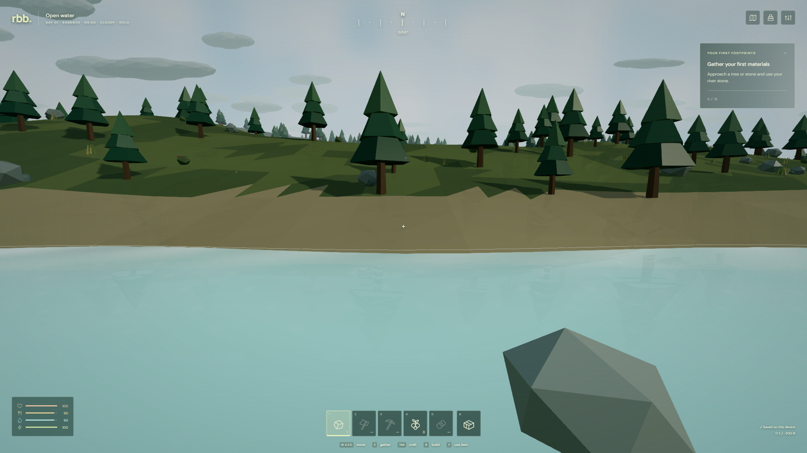                             |
| Elevated view: faceted banks versus a soft cloud volume       | 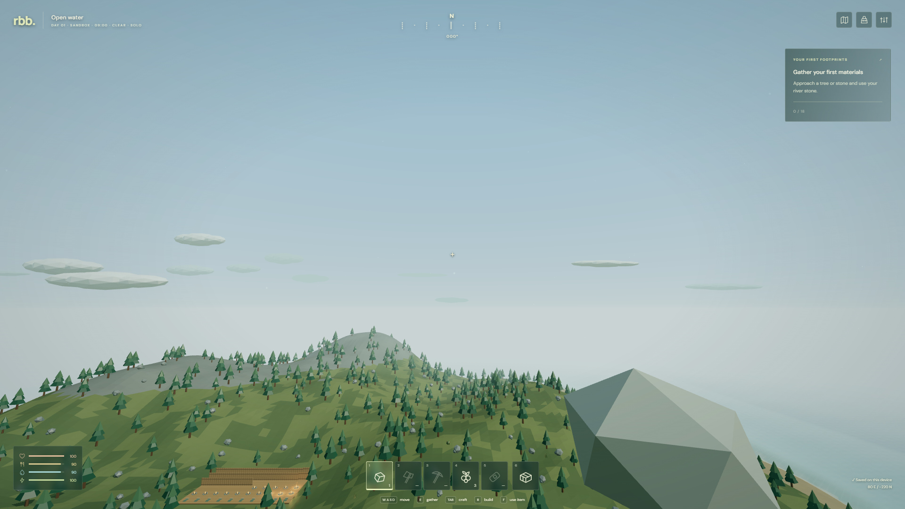 | 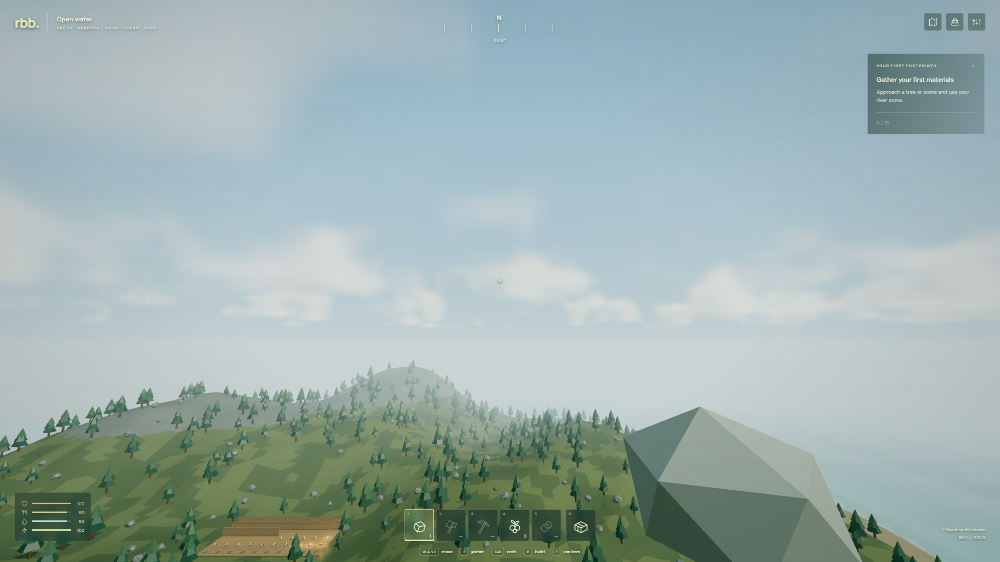                        |

The [all-advanced capture](images/advanced-all-advanced.png) and [High with all old and new effects](images/advanced-all-effects.png) demonstrate composition. They are stress cases: combined fog and focus soften more of the image than most players will want. Motion blur is exercised while moving in browser checks; a stationary benchmark screenshot cannot demonstrate its shutter motion. Occlusion and residency should preserve the visible scene, so their useful evidence is delayed-query/resource counters and successful travel back into released regions.

| Mobile viewport, clouds/fog/reflections/temporal enabled                               | Low, all advanced preferences requested but suppressed                                     |
| -------------------------------------------------------------------------------------- | ------------------------------------------------------------------------------------------ |
| 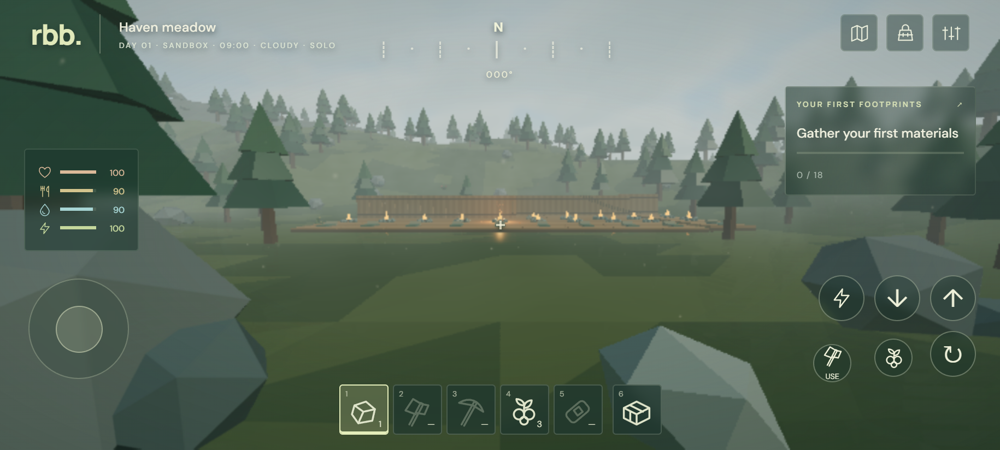 | 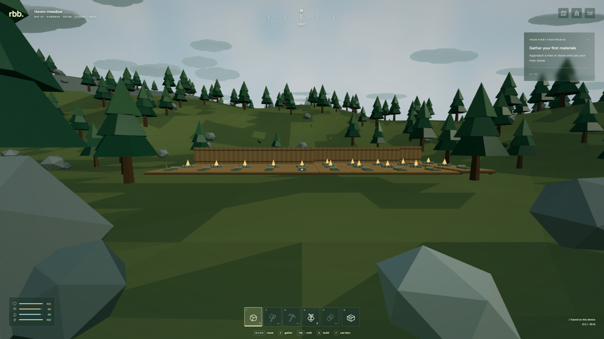 |

### Measured costs

Run started **2026-09-14 17:24 UTC**, Chrome / ANGLE Direct3D11 on **RTX 4070 SUPER**, 1920 × 1080 at ratio 1.0 unless indicated. Single effects use Balanced with the numeric defaults above. [Recorded JSON](benchmark-0.3.json) includes all 20 cases, enabled switches, GPU identity, pipeline state, counters and warnings.

| Case                                              | Median GPU ms | Sampled GPU p95 ms | Maximum total draws | Estimated target MiB |
| ------------------------------------------------- | ------------: | -----------------: | ------------------: | -------------------: |
| Camp baseline, start                              |          3.99 |               9.44 |                 246 |                    0 |
| Cascaded shadows                                  |          3.96 |              12.72 |                 740 |                    0 |
| Volumetric clouds                                 |          5.78 |               8.30 |                 421 |                 91.0 |
| Volumetric fog                                    |          5.94 |               9.82 |                 422 |                 91.0 |
| Probe indirect lighting                           |          4.53 |               9.95 |                 364 |                    0 |
| Screen reflections                                |          5.63 |               8.96 |                 421 |                 87.0 |
| Temporal upscaling                                |          4.85 |              10.24 |                 421 |                 70.7 |
| Motion blur                                       |          4.60 |              16.26 |                 421 |                 87.0 |
| Depth of field                                    |          5.46 |               8.59 |                 421 |                 87.0 |
| GPU occlusion                                     |          1.96 |               5.39 |                 429 |                 39.6 |
| Distant buffer residency                          |          4.63 |               8.52 |                 246 |                    0 |
| All ten advanced, Balanced                        |          6.54 |              10.57 |                 983 |                 72.5 |
| High, all advanced + AO/bloom/shafts/flare/planar |          8.12 |              11.70 |               1,518 |                 72.5 |
| Coast baseline                                    |          4.16 |               7.82 |                 207 |                    0 |
| Coast + screen reflections                        |          5.48 |               8.61 |                 380 |                 87.0 |
| Elevated baseline                                 |          4.55 |              12.37 |                 174 |                    0 |
| Elevated + cloud volume                           |          5.52 |               8.02 |                 317 |                 91.0 |
| Mobile viewport, four effects; 915 × 412 / 1.15   |          3.34 |               6.59 |                 194 |                 17.4 |
| Low, advanced requested; 1920 × 1080 / 0.8        |          2.75 |               6.37 |                  89 |                    0 |
| Camp baseline, end control                        |          4.38 |              19.75 |                 246 |                    0 |

Frame pacing held every case near **56 FPS** in this run, so FPS does not expose GPU headroom. The repeated baseline moved from 3.99 to 4.38 ms; clocks, scheduling and background load were not controlled. Treat rows as indicative costs, not precise effect deltas or a conversion to achievable FPS. In particular, temporal reconstruction adds overhead to this inexpensive scene, and occlusion's stable-view result needs a moving-camera/device profile before making a speedup claim. Draw counts include geometry, shadow, reflection, query and post passes.

All 20 cases completed with zero browser exceptions or WebGL validation errors. One cloud case produced ANGLE compiler warnings in the installed FXAA shader about gradient evaluation and a potentially uninitialized temporary; rendering completed, and the raw warning is retained. It is not suppressed or counted as a clean compiler log.

Zero in the target column means no **shared post targets**, not zero effect memory. Cascaded shadow maps and probe capture/storage are additional; a High all-effects stack also owns the older AO, bloom and planar targets. Shared targets make combined costs non-additive, while temporal input scaling reduces intermediate sizes. The default 320 m residency radius released eight chunk records at this camp; the browser travel test uses 128 m to verify release and re-upload.

The first practical follow-up is physical-device profiling, then selective tuning: shadows/fog for depth, reflections for wet/coastal views, and temporal reconstruction where pixel work is the bottleneck. Keep motion blur and focus as taste controls. More demanding probe visibility, cloud shadows and reconstruction quality work can build on these shared resources when their visual benefit warrants the cost.

## Verification and remaining work

Tests cover opt-in defaults, legacy preferences, capability fallbacks, Low progression parity, live buffer references, camera/jitter restoration and material-hook removal. Browser scenarios use actual controls for the combined graph, water travel, Low switching, resource release/recreation, normal/velocity views and streamed-buffer reload. Desktop and software rendering are checked separately. Final evidence is recorded in [QA](qa.md).

Next steps: physical RTX 3070 Ti/S25 warm-device profiling; probe visibility/relocation and vertical layers; cloud-to-ground shadows and multiple scattering; particle/sky reactive masks, history sharpening and velocity dilation; shared-buffer GTAO; hierarchical depth culling and batched indirect submission on a suitable backend. Infinite-world streaming also needs world generation, collision, persistence, networking and interest-management changes. Those systems were not replaced in this rendering update.

Ray tracing remains out of scope. Revisit costlier techniques when scenes need them, device measurements justify them and quality is competitive with mature examples.

## Primary implementation references

- [Three.js CSM](https://threejs.org/docs/pages/CSM.html) and installed r186 source establish cascade lifecycle/shader integration. RBB preserves other material adapters around that lifecycle.
- [LightProbe](https://threejs.org/docs/pages/LightProbe.html) and [LightProbeGenerator](https://threejs.org/docs/pages/LightProbeGenerator.html) provide SH representation and asynchronous extraction. RBB supplies placement, scheduling, interpolation and invalidation.
- [Irradiance environment maps](https://graphics.stanford.edu/papers/envmap/envmap.pdf) explain low-order SH diffuse lighting.
- [AMD temporal super-resolution documentation](https://gpuopen.com/manuals/fidelityfx_sdk/techniques/super-resolution-temporal/) is a design reference for motion, depth, jitter and reactive inputs. RBB does not integrate FidelityFX or claim its reconstruction quality.
